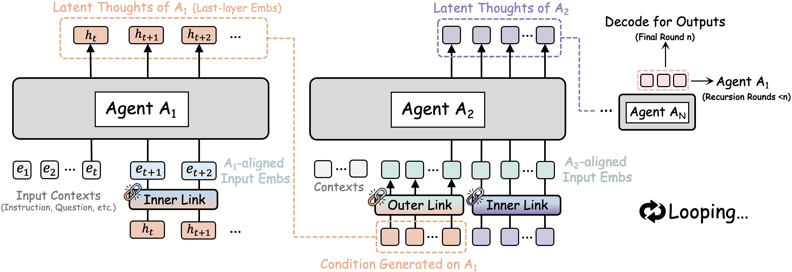
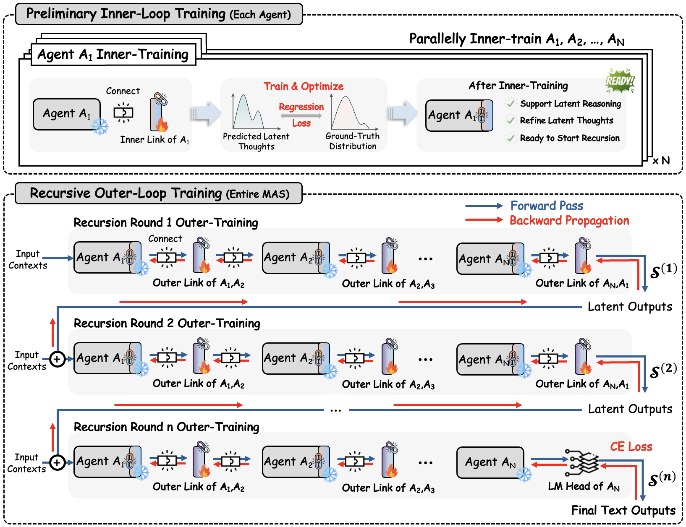
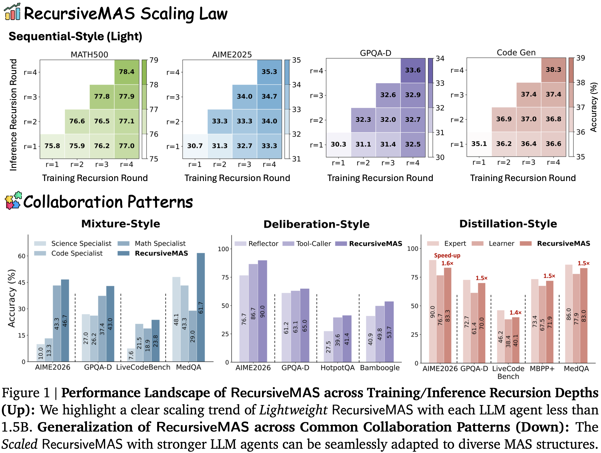
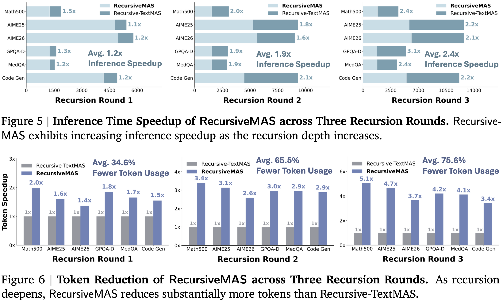

<p align="center">
  <picture>
    <source media="(prefers-color-scheme: dark)" srcset="assets/logo.png">
    
  </picture>
</p>

<h3 align="center">
Scaling agent collaboration through latent-space recursion.
</h3>

---

## 📰 News

- **[2026.04.28]** RecursiveMAS paper released! The evaluation [code](https://github.com/RecursiveMAS/RecursiveMAS) and [checkpoints](https://huggingface.co/RecursiveMAS/models) are now available. Stay tuned for the overall training pipeline and more features!

## 🌟 Introduction

<p align="center">
  
</p>

**RecursiveMAS** is a multi-agent framework that scales agent collaboration through **latent-space recursion**.

<p align="center">
  
</p>

Instead of treating each LLM agent as an isolated module, RecursiveMAS casts the entire multi-agent system as a **unified recursive computation**. Heterogeneous agents are connected through lightweight RecursiveLink modules, allowing agents to iteratively exchange, refine, and evolve their latent states across recursion rounds.

## ✨ Key Features of RecursiveMAS

- **System-level recursion**: RecursiveMAS organizes the entire multi-agent system as a recursive loop, where agents repeatedly refine the shared latent information flow across recursion rounds.

- **Inner and Outer RecursiveLink**: RecursiveMAS uses lightweight residual projection modules to support both agent-level latent-thoughts generation and cross-agent latent information transfer.

- **Generalizable collaboration patterns**: RecursiveMAS can be seamlessly adapted to diverse MAS structures, including Sequential-style, Mixture-style, Distillation-style, and Deliberation-style collaboration.

- **Strong and efficient performance**: Across 9 benchmarks, RecursiveMAS achieves an average accuracy improvement of 8.3%, together with 1.2×–2.4× end-to-end inference speedup and 34.6%–75.6% token usage reduction.


---

## 📊 Experiments

### 🚀 RecursiveMAS Scales Performance and Generalization

RecursiveMAS demonstrates a clear scaling trend across both training-time and inference-time recursion depths. Additionally, RecursiveMAS also generalizes to diverse MAS collaboration patterns.

<p align="center">
  
</p>


---

### ⚡ Superior Efficiency of RecursiveMAS

Compared with Recursive-TextMAS under the same MAS structure and recursion budget, RecursiveMAS achieves increasing inference-time speedup as the recursion depth becomes larger.

<p align="center">
  
</p>


---

## 🛠️ Experiment Setup

This repository provides the code for running RecursiveMAS under different multi-agent collaboration styles. 

To begin with, we recommend creating a new conda environment:

```bash
conda create -n recursivemas python=3.10 -y
conda activate recursivemas
```

Install the required packages:

```bash
pip install -r requirements.txt
```

---


## 💥 Quick Start

### 🤖 Load Model Checkpoints

To run RecursiveMAS, you need to download and store the checkpoints for each agent role in the multi-agent system from our Hugging Face release.

The checkpoints are organized by collaboration style. Each collection contains the individual role-specific agent together with their RecursiveLink modules.

### [Sequential-Style (Light) MAS Collection](https://huggingface.co/collections/RecursiveMAS/sequential-style-recursivemas)

| **Model Organization** | **Download** |
| ---------------------- | ------------ |
| Sequential-Light-Planner-Qwen3-1.7B | [🤗 HuggingFace](https://huggingface.co/RecursiveMAS/Sequential-Light-Planner-Qwen3-1.7B) |
| Sequential-Light-Critic-Llama3.2-1B | [🤗 HuggingFace](https://huggingface.co/RecursiveMAS/Sequential-Light-Critic-Llama3.2-1B) |
| Sequential-Light-Solver-Qwen2.5-Math-1.5B | [🤗 HuggingFace](https://huggingface.co/RecursiveMAS/Sequential-Light-Solver-Qwen2.5-Math-1.5B) |
| Sequential-Light-Outerlinks | [🤗 HuggingFace](https://huggingface.co/RecursiveMAS/Sequential-Light-Outerlinks) |

### [Sequential-Style (Scaled) MAS Collection](https://huggingface.co/collections/RecursiveMAS/sequential-style-recursivemas)

| **Model Organization** | **Download** |
| ---------------------- | ------------ |
| Sequential-Scaled-Planner-Gemma3-4B | [🤗 HuggingFace](https://huggingface.co/RecursiveMAS/Sequential-Scaled-Planner-Gemma3-4B) |
| Sequential-Scaled-Critic-Llama3.2-3B | [🤗 HuggingFace](https://huggingface.co/RecursiveMAS/Sequential-Scaled-Critic-Llama3.2-3B) |
| Sequential-Scaled-Solver-Qwen3.5-4B | [🤗 HuggingFace](https://huggingface.co/RecursiveMAS/Sequential-Scaled-Solver-Qwen3.5-4B) |
| Sequential-Scaled-Outerlinks | [🤗 HuggingFace](https://huggingface.co/RecursiveMAS/Sequential-Scaled-Outerlinks) |

### [Mixture-Style MAS Collection](https://huggingface.co/collections/RecursiveMAS/mixture-style-recursivemas)

| **Model Organization** | **Download** |
| ---------------------- | ------------ |
| Mixture-Math-DeepSeek-R1-Distill-Qwen-1.5B | [🤗 HuggingFace](https://huggingface.co/RecursiveMAS/Mixture-Math-DeepSeek-R1-Distill-Qwen-1.5B) |
| Mixture-Code-Qwen2.5-Coder-3B | [🤗 HuggingFace](https://huggingface.co/RecursiveMAS/Mixture-Code-Qwen2.5-Coder-3B) |
| Mixture-Science-BioMistral-7B | [🤗 HuggingFace](https://huggingface.co/RecursiveMAS/Mixture-Science-BioMistral-7B) |
| Mixture-Summarizer-Qwen3.5-2B | [🤗 HuggingFace](https://huggingface.co/RecursiveMAS/Mixture-Summarizer-Qwen3.5-2B) |
| Mixture-Outerlinks | [🤗 HuggingFace](https://huggingface.co/RecursiveMAS/Mixture-Outerlinks) |

### [Distillation-Style MAS Collection](https://huggingface.co/collections/RecursiveMAS/distillation-style-recursivemas)

| **Model Organization** | **Download** |
| ---------------------- | ------------ |
| Distillation-Expert-Qwen3.5-9B | [🤗 HuggingFace](https://huggingface.co/RecursiveMAS/Distillation-Expert-Qwen3.5-9B) |
| Distillation-Learner-Qwen3.5-4B | [🤗 HuggingFace](https://huggingface.co/RecursiveMAS/Distillation-Learner-Qwen3.5-4B) |
| Distillation-Outerlinks | [🤗 HuggingFace](https://huggingface.co/RecursiveMAS/Distillation-Outerlinks) |

### [Deliberation-Style MAS Collection](https://huggingface.co/collections/RecursiveMAS/deliberation-style-recursivemas)

| **Model Organization** | **Download** |
| ---------------------- | ------------ |
| Deliberation-Reflector-Qwen3.5-4B | [🤗 HuggingFace](https://huggingface.co/RecursiveMAS/Deliberation-Reflector-Qwen3.5-4B) |
| Deliberation-Toolcaller-Qwen3.5-4B | [🤗 HuggingFace](https://huggingface.co/RecursiveMAS/Deliberation-Toolcaller-Qwen3.5-4B) |
| Deliberation-Outerlinks | [🤗 HuggingFace](https://huggingface.co/RecursiveMAS/Deliberation-Outerlinks) |


Here is an example of how to load the whole MAS pipeline:

```python
from system_loader import load_mas_system

mas = load_mas_system(
    style="sequential_light",
    device="cuda",
    trust_remote_code=True,
)

planner = mas.agents["planner"].model
critic = mas.agents["critic"].model
solver = mas.agents["solver"].model
```

Detailed running code for loading agents and running RecursiveMAS on downstream tasks is provided in `run.py`. 


### 🔍 Clone the Repository

Next, clone our repository and enter the project directory:

```bash
git clone https://github.com/RecursiveMAS/RecursiveMAS.git
cd RecursiveMAS
```

The current repository is organized as follows:

```text
RecursiveMAS/
├── README.md
├── __init__.py
├── run.py
├── load_from_repo.py
├── hf_resolver.py
├── modeling.py
├── system_loader.py
├── prompts.py
├── requirements.txt
├── assets/
├── dataset/
└── inference_utils/
    ├── __init__.py
    ├── answer_utils.py
    ├── lcb_utils.py
    ├── reflector_tool_notes.py
    ├── inference_mas.py
    ├── inference_mas_mixture.py
    ├── inference_mas_distill.py
    └── inference_mas_deliberation.py
```

The key components are:

- `run.py`: the unified entry point for running RecursiveMAS inference.
- `load_from_repo.py`: maps each MAS style to our released Hugging Face checkpoints and dataset defaults.
- `hf_resolver.py`: resolves and load the Hugging Face checkpoints.
- `modeling.py`: implements RecursiveLink modules.
- `system_loader.py`: provides a high-level API for loading a full released multi-agent system.
- `prompts.py`: stores prompts for different MAS collaboration styles.
- `inference_utils/`: contains inference pipelines and evaluation utilities for different MAS structures.

---

### ⚙️ Running RecursiveMAS at Different Scales

We provide Sequential-style RecursiveMAS under both lightweight and scaled settings.

- **Sequential-style (Light)** uses lightweight agents for efficient recursive collaboration.
```bash
python run.py --style sequential_light --batch_size 16 --temperature 0.6 --top_p 0.95 --dataset math500 --seed 42 --trust_remote_code 1 --device cuda
```


- **Sequential-style (Scaled)** uses stronger LLM agents to further improve reasoning performance.
```bash
python run.py --style sequential_scaled --batch_size 16 --temperature 0.6 --top_p 0.95 --dataset math500 --seed 42 --trust_remote_code 1 --device cuda
```
---

### 🧩 Exploring Various Collaboration Patterns

RecursiveMAS can also be adapted to different MAS collaboration patterns beyond the sequential setting.

- **Mixture-style RecursiveMAS** coordinates multiple domain-specialized agents and aggregates their information through a summarizer.
```bash
python run.py --style mixture --batch_size 16 --temperature 0.6 --top_p 0.95 --dataset math500 --seed 42 --trust_remote_code 1 --device cuda
```

- **Distillation-style RecursiveMAS** enables a larger Expert and a smaller Learner to interact recursively, improving the Learner while retaining better efficiency.
```bash
python run.py --style distillation --batch_size 16 --temperature 0.6 --top_p 0.95 --dataset math500 --seed 42 --trust_remote_code 1 --device cuda
```

- **Deliberation-style RecursiveMAS** supports recursive coordination between a Reflector and a Tool-Caller for tool-integrated reasoning.
```bash
python run.py --style deliberation --batch_size 16 --temperature 0.6 --top_p 0.95 --dataset math500 --seed 42 --trust_remote_code 1 --device cuda
```

---

## 🙏 Acknowledgements

This project is built upon the excellent open-source community. We sincerely thank the developers and maintainers of the following libraries and resources:

- [vLLM](https://github.com/vllm-project/vllm) for supporting efficient LLM inference and serving.
- [ARPO](https://github.com/RUC-NLPIR/ARPO) for providing useful references on agentic tool-use systems and efficient tool-calling workflows.
- [TextGrad](https://github.com/zou-group/textgrad) for its pioneering framework on text-based optimization and natural-language feedback for compound agentic systems.

---
<!-- 
## 🚀 Contributing

We welcome discussions and contributions to RecursiveMAS. If you would like to suggest improvements, please feel free to contact us.

- [Xiyuan Yang](mailto:xiyuany4@illinois.edu)
- [Jiaru Zou](mailto:jiaru@stanford.edu)

--- -->

## 📚 Citation
```text
@article{recursivemas,
  title={Recursive Multi-Agent Systems},
  author={Yang, Xiyuan and Zou, Jiaru and Pan, Rui and Qiu, Ruizhong and Lu, Pan and Diao, Shizhe and Jiang, Jindong and Tong, Hanghang and Zhang, Tong and Buehler, Markus J. and He, Jingrui and Zou, James},
  year={2026}
}
```
